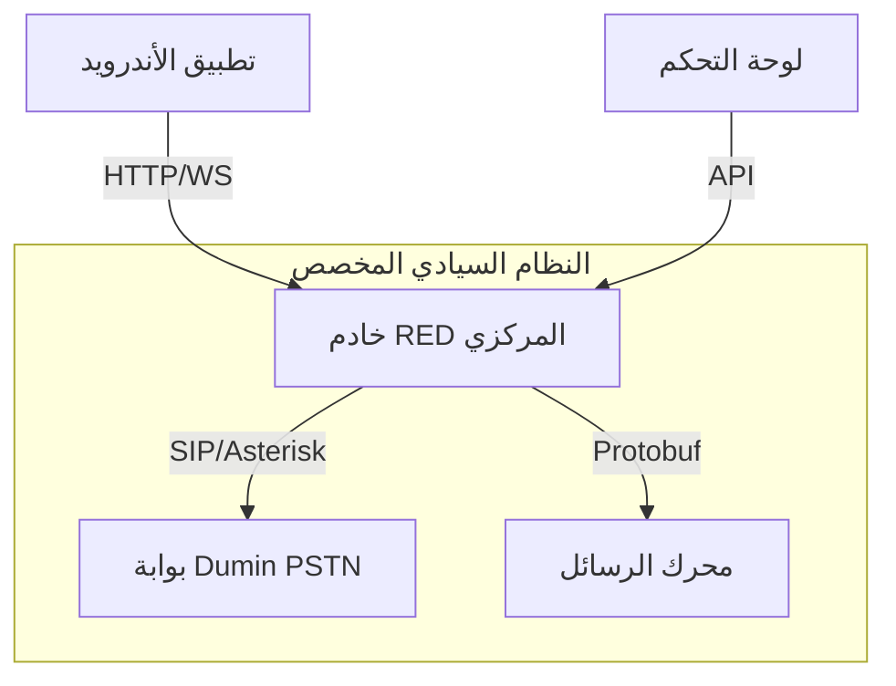

# التقرير الفني الشامل والعميق لمشروع RED Ultimate

يقدم هذا التقرير تحليلاً تشريحياً كاملاً لمشروع **RED Ultimate**، وهو نظام تواصل سيادي مبني على نواة Signal، تم تعديله ليعمل في بيئة معزولة بالكامل مع ميزات متقدمة للتحكم والاتصال.

---

## 1. المعمارية الهيكلية (Structural Architecture)

المشروع مبني بنظام **Monorepo** يجمع بين أربعة عوالم تقنية:
- **تطبيق الأندرويد الأساسي:** نسخة مطورة من Signal تدعم التشفير الكمومي.
- **نواة RED السيادية:** مجموعة من المحركات المخصصة (Systems A, B, C).
- **الخادم المركزي:** خادم Spring Boot يدير الهوية والتسليم والتحكم.
- **لوحة التحكم:** واجهة React للمراقبة والإدارة اللحظية.

````carousel

<!-- slide -->
### المكونات البرمجية
- **Language:** Kotlin 2.2 / Java 21 / TypeScript
- **Frameworks:** Spring Boot 3.4 / React 18 / Jetpack Compose
- **Database:** SQLCipher (Android) / PostgreSQL & MongoDB (Server)
````

---

## 2. تحليل الأنظمة الجوهرية (The Core Engines)

### النظام A: الاتصال الصوتي والمرئي (Ultra HD VoIP)
- **التقنية:** يعتمد على تخصيص بروتوكول WebRTC لدعم دقة **4K**.
- **الكوديك:** استخدام **AV1** لضمان أعلى جودة بأقل استهلاك للبيانات.
- **الذكاء الاصطناعي:** دمج **RNNoise** لعزل الضوضاء الخلفية برمجياً.

### النظام B: الاتصال الهاتفي المعزول (PSTN / Dumin)
- **الوظيفة:** يسمح للتطبيق بالاتصال بأرقام هواتف حقيقية عبر بوابة SIM خاصة.
- **التكامل:** يتم الربط مع خادم **Asterisk** محلي لإدارة المكالمات الصادرة والواردة.

### النظام C: نظام التسليم المضمون (Guaranteed Delivery)
- **الآلية:** يستخدم **UUID v7** لضمان ترتيب الرسائل زمنياً بدقة متناهية.
- **الموثوقية:** محرك إرسال موازي يقوم بحفظ الرسالة في قاعدة بيانات Room قبل الإرسال، مع نظام إعادة محاولة ذكي (Exponential Backoff).

---

## 3. التدقيق الأمني واكتشاف الثغرات (Security Audit)

> [!CAUTION]
> تم اكتشاف ثغرات أمنية حرجة تتطلب معالجة فورية لضمان سلامة النظام.

### أ. ثغرة قناة الاتصال (Unsecured Channel)
- **الملف:** [DevelopedServerConfig.java](file:///C:/Users/PC1/AndroidStudioProjects/RED_Ultimate/app/src/main/java/org/thoughtcrime/securesms/dependencies/DevelopedServerConfig.java)
- **الخلل:** استخدام بروتوكول `http://` بدلاً من `https://` للاتصال بالخادم المركزي.
- **الخطر:** إمكانية اعتراض كافة البيانات (حتى لو كانت مشفرة E2EE، فإن بيانات التعريف Metadata تكون مكشوفة).

### ب. تجاوز آلية الموافقة (Approval Bypass)
- **الملف:** `DevelopedChatCore.kt`
- **الخلل:** دالة `checkApprovalStatus()` تعيد `true` دائماً بشكل ثابت (Hardcoded).
- **الخطر:** أي مستخدم يمكنه تفعيل الأنظمة السيادية دون انتظار موافقة المدير، مما يبطل ميزة التحكم الإداري.

### ج. ضعف مخزن الشهادات (TrustStore Weakness)
- **الملف:** [SignalServiceTrustStore.java](file:///C:/Users/PC1/AndroidStudioProjects/RED_Ultimate/app/src/main/java/org/thoughtcrime/securesms/push/SignalServiceTrustStore.java)
- **الخلل:** استخدام كلمة مرور افتراضية "whisper" لملف الشهادات الخام `R.raw.whisper`.

---

## 4. ميزات التحكم الإداري (Admin & Kill-Switch)

يوفر النظام أدوات تحكم استثنائية للمسؤول المحلي:
1.  **Kill Switch:** ميزة برمجية تسمح للمسؤول بمسح كافة بيانات مستخدم معين عن بُعد فورياً عبر أوامر WebSocket.
2.  **User Approval:** نظام "الموافقة المسبقة" الذي يمنع استخدام التطبيق قبل التحقق من هوية المستخدم في لوحة التحكم.
3.  **Dumin Monitor:** مراقبة حالة شرائح الاتصال (SIM) وقوة الإشارة في البوابة المحلية.

---

## 5. التوصيات النهائية وخطة التحسين

1.  **تشفير TLS:** تحويل كافة الروابط في `DevelopedServerConfig` إلى **HTTPS** فوراً.
2.  **ديناميكية التحقق:** استبدال القيم الثابتة في `checkApprovalStatus` بطلب (API Call) فعلي للخادم.
3.  **تأمين الـ TrustStore:** توليد شهادات جديدة بكلمة مرور معقدة وتخزينها في `Android KeyStore`.
4.  **تفعيل الـ Scrubber:** التأكد من تفعيل نظام تنظيف السجلات (Logs) لمنع تسريب عناوين IP المستخدمين في بيئة الخادم.

---
> [!IMPORTANT]
> هذا المشروع يمثل قفزة تقنية في مجال التواصل الخاص، ولكن نجاحه يعتمد كلياً على سد الثغرات المذكورة أعلاه لضمان أن "السيادة الرقمية" لا تأتي على حساب "الأمن التقني".
